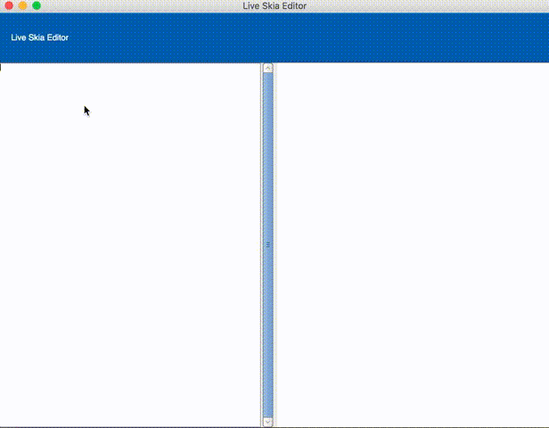

# FormsGtkLive

**Live Skia** editor with Xamarin Forms using Gtk+ backend.

    

## Setup

Clone this repository. Open the solution in **FormsGtkLive.sln** with Visual Studio for Mac, update NuGet packages and run FormsGtkLive.

**Disclaimer** This project has only be tested in a MacOS operating system with Visual Studio for Mac.

## Usage

In the editor, write the Skia# code as if you were writting a function with a *SKCanvas canvas* parameter.
```
// clear the canvas / fill with red
canvas.Clear (SKColors.Red);
```

You can also directly copy and paste any of the examples in [Xamarin's Skia introduction ](https://developer.xamarin.com/guides/cross-platform/skiasharp/introduction/).

Internally, the code in the editor is evaluated into an Action like:
```
var codeToEval = $"new Action<SKCanvas>((SKCanvas canvas) => {{ {code} }});";
```

This action will be executed in the SKWidget's PaintSurface callback.

Compiler errors will be reported in red at the bottom of the main window.

## Feedback 

This project was created for fun, it's not ready for production and I don't plan to maintain it. You are free to fork it and change for your own needs :)

## License

Code released under the [MIT license](https://opensource.org/licenses/MIT).

## References

This project uses [GtkFormsLive](https://github.com/jsuarezruiz/FormsGtkLive) from @jsuarezruiz for the Xamarin Forms UI and
[Continous](https://github.com/praeclarum/Continuous) from @praeclarum for the C# evaluator.

